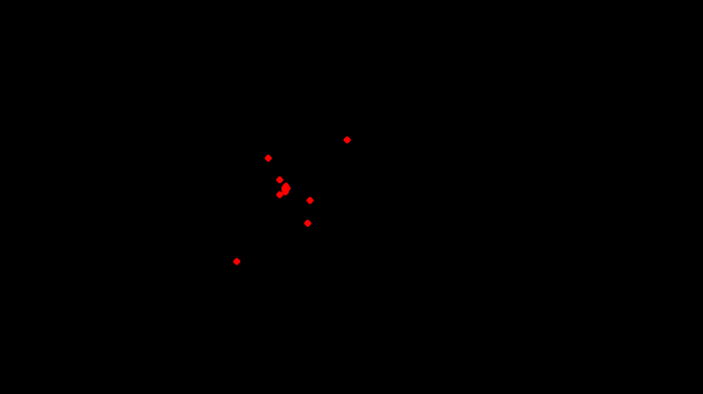

# Particle Life
Exploring emergent behavior with particle dynamics  

## Roadmap
[X] Basic particle setup - I want to be able to spawn particles with varying masses and sizes, and have them affect each other  
[O] Proper particle collision - I want particles to be able to "stick" to each other, to be able to create larger structures  
[O] Different particle classes - I want to implement different particle "classes" where each class has different attraction and deflection properties  
[O] GUI probably? Haven't thought this far yet to be honest

## Screenshots
I dunno, see what I have so far I guess 
